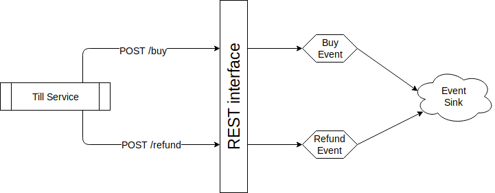

Note: This article assumes knowledge of the concepts discussed in the introduction article

# Introduction

Here we'll look at abstractions mewbase provides to help you apply [CQRS](https://www.martinfowler.com/bliki/CQRS.html) and/or [Event Sourcing](https://martinfowler.com/eaaDev/EventSourcing.html) patterns in a system.

These patterns isolate imperative commands (e.g. "buy") from their interpretation (e.g. shipping goods). In fact, they allow different components in a system to interpret the same command in different ways.

## An example

A user can give our system a command by hitting the "Buy" button after they've added lots of groceries to their shopping basket.

In an Event Sourced system this command won't be immediately enacted, instead it'll be turned into an event that might capture:

* The time of the event
* Who the user is
* Which products are in their basket
* The action: buy!

The event will be persisted in an Event Store, along with other events of different shapes and sizes.

Events can later be replayed into read models that provide different interpretations:
* A billing read model might group purchases by customer to form a single credit card transaction
* A sales read model might group purchases by product to highlight buying trends

These read models are entirely based on event log data, and have an entirely different structure and meaning to the orignial commands.<br/>
This is [CQRS](https://www.martinfowler.com/bliki/CQRS.html) + [Event Sourcing](https://martinfowler.com/eaaDev/EventSourcing.html).


# Building events from commands

In this sample we're going to concentrate on how to build events from commands.



In this example, we're assuming a service that runs on tills, and interacts with a [REST endpoint](https://en.wikipedia.org/wiki/Representational_state_transfer) when customers buy things.<br/>
Customers may also ask for a refund if they're not happy with a product, in this case the till will interact with a different [REST endpoint](https://en.wikipedia.org/wiki/Representational_state_transfer).

If a customer buys 2 bread and returns 1 apple, the following interactions would happen:

```
POST /buy
{
    "product": "bread",
    "quantity": 2
}
```

```
POST /refund
{
    "product" "apple",
    "quantity": 1
}
```

Mewbase has components that will make the REST interface very easily to build.

## Event Sink

In this sample we're going to use [Apache Kafka](https://kafka.apache.org/) as an Event Store.<br/>
It's a widely used, high performance streaming platform.

If you're interested in finding more about [Apache Kafka](https://kafka.apache.org/) the [introduction documentation](https://kafka.apache.org/intro) is extremely useful.

Mewbase is able to use Kafka as an Event Sink - somewhere to publish events.

To do so, we must configure mewbase to use a Kafka, and tell it where to find our broker:

`examples-java/src/main/java/example/gettingstarted/commandrest/configuration.config`
```
mewbase {
  event {
    sink {
      factory = "io.mewbase.eventsource.impl.kafka.KafkaEventSink"
      kafka {
        bootstrap = "localhost:9092"
      }
    }
  }
  ...
```

## REST adapter

Mewbase has a REST adapter, which you can use to expose mewbase components over HTTP.

* Event Sinks can be exposed to record events whenever a `POST` to a defined endpoint occurs
* Binders can be exposed to allow access to aggregate documents stored in them

In this sample, we'll expose an Event Sink hooked up to Kafka, and fire an event whenever `/buy` or `/refund` are `POST`ed to.

We must configure mewbase to use a specific engine to provide the REST service, and tell it which port to listen to:

`examples-java/src/main/java/example/gettingstarted/commandrest/configuration.config`
```
mewbase {
  ...
  api {
    rest {
      factory = "io.mewbase.rest.impl.VertxRestServiceAdaptor"
      vertx {
        host = "127.0.0.1"
        port = 9000
        timeout = 30 seconds
      }
    }
  }
```

This tells mewbase to use [Eclipse Vert.x](https://vertx.io/) to power the REST service, and to listen on port 9000.

# Starting a REST server

Now all the config is done, it's dead easy to start a REST server:

```java
public static void main(String[] args) {
    final Config config = ConfigFactory.load("example/gettingstarted/commandrest/configuration.conf");
    try (final RestServiceAdaptor restServiceAdaptor = RestServiceAdaptor.instance(config)) {
        restServiceAdaptor.start();
        try {
            System.in.read();
        } catch (IOException e) {
            e.printStackTrace();
        }
    }
}
```

It's quite easy:
* we load our sample config
* get an instance of a `RestServiceAdaptor` from the factory we specified in the config (it'll be a [Eclipse Vert.x](https://vertx.io/) implementation)
* then we start it

# Building a command

That's all good, but it doesn't have any endpoints.

First let's bring in an instance of our Event Sink:

```java
public static void main(String[] args) {
    final Config config = ConfigFactory.load("example/gettingstarted/commandrest/configuration.conf");
    try (final RestServiceAdaptor restServiceAdaptor = RestServiceAdaptor.instance(config)) {
        try (final EventSink eventSink = EventSink.instance(config)) {
            restServiceAdaptor.start();
            try {
                System.in.read();
            } catch (IOException e) {
                e.printStackTrace();
            }
        }
    }
}
```

We can now use a `CommandManager` to define a "buy" `Command`.<br/>
The command will cause an event to be sent to the `EventSink` associated with the `CommandManager`:

```java
final CommandManager commandManager = CommandManager.instance(eventSink);
```

We now use the `CommandManager` to build a "buy" `Command`:

```java
final Command buyCommand =
    commandManager
        .commandBuilder()
        .named("buy")
        .as(params -> {
            final BsonObject event = new BsonObject();
            event.put("product", params.getBsonObject("body").getString("product"));
            event.put("quantity", params.getBsonObject("body").getInteger("quantity"));
            event.put("action", "BUY");
            return event;
        })
        .emittingTo("purchase_events")
        .create();
```

This has a few important parts:

## The command name

This will be the name of the endpoint exposed by the `RestAdapter`.

In this case, it'll be `/buy`turning

## The command handler

This is a function responsible for building an event that will be sent to the Event Sink.

The actual HTTP request made to the REST service will be a `POST` of `Content-Type` `application/json`.<br/>
Mewbase's `RestServiceAdapter` will translate this into a [BSON object](http://bsonspec.org/).

This BSON object is then provided as input to your command handler function (accessible under the object key of `body`).

Your function must translate this BSON object into an event - which is also a BSON object.

In this example, the POST body looks like so:
```json
{
    "product": "banana",
    "quantity": 1
}
```

and the corresponding event our command handler produces looks like so:

```json
{
    "product": "banana",
    "quantity": 1,
    "action", "BUY"
}
```

## Channel to emit to

Kafka allows you to organise streams of messages into topics, which can be used to segregate different forms of messages.<br/>
The final part of the `Command` is the channel (or topic) resulting events will be emitted to.

In this example, the event will be emitted to the `purchase_events` topic.

# Exposing the command

When the command has been built, we can tell our `RestServiceAdapter` to expose it like so:

```java
restServiceAdaptor.exposeCommand(commandManager, buyCommand.getName());
```

We provide the `CommandManager` on which the command was built, and the name of the command.

# Running the sample

To get it up and running, firstly ensure Docker and Docker Compose are installed:
* [Docker Installation](https://docs.docker.com/install/)
* [Docker Compose Installation](https://docs.docker.com/compose/install/)

Next:

1. Clone the mewbase project
1. Open a terminal at `examples-java/src/main/java/example/gettingstarted/commandrest`
1. Run `docker-compose up`

This will grab a Linux image with Kafka installed and configured. It'll bring it up in a docker container, and expose the port the Kafka broker is listening to (9092) on your machine.

You can then run `example.gettingstarted.commandrest.Main` to start the REST server.

To see things up and running you can run

```bash
curl --verbose -H 'Content-Type: application/json' --data "{\"product\": \"banana\", \"quantity\": 1231}" -X POST http://localhost:9000/buy
```

To enact a command, causing an event to be stored in Kafka

If you'd like to see the events arrive in Kafka, you can run:

```bash
$ docker exec -i -t mewbase-gs-kafka /bin/bash
$ $KAFKA_HOME/bin/kafka-console-consumer.sh --zookeeper localhost:2181 --topic purchase_events
```

This will start a console consumer against the purchase_events topic, and you'll be able to see events arrive when the BUY or REFUND command is enacted.

# Summary

Mewbase has a number of powerful abstractions that allow you to:
* Expose commands through a RESTful service
* Convert them into an event stream in some Event Store

In the next sample we'll look at how to build different aggregations from an event stream.
