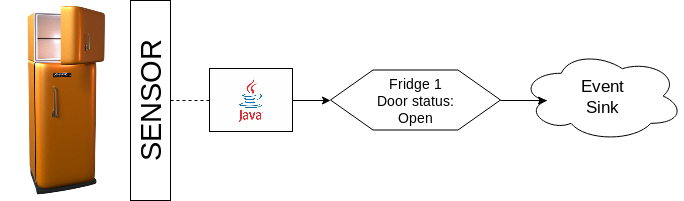
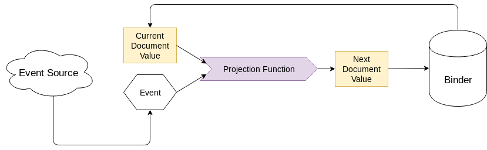
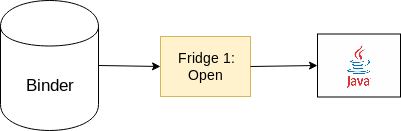
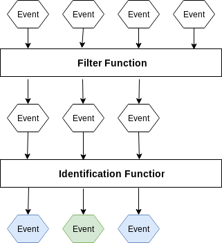

Fridge Example
==============

This example gives a practical introduction to fundamental concepts in Mewbase:

* Event Sources
* Event Sinks
* Projections

We will model a set of Fridges (Refrigerators), which are always in either an "open" or a "closed" state.

* One part of our system emits an event to a Mewbase Event Sink, recording when a fridge door is opened or closed.




* A Mewbase Projection Function models the current state of each fridge, in reaction to incoming events. The state is stored in a document, indexed within a binder



* Another part of our system is able to read the current state of a fridge at any time.




# Initialising Mewbase Resources

In this system we need a bunch of resources to model our problem

```java
try (
        EventSource src = EventSource.instance(); // a source raw event data
        BinderStore store = BinderStore.instance(); // holds a collection of documents. each document represents the state of a fridge
        EventSink sink = EventSink.instance(); // a receiver of raw event data. it writes events to the event source
        ProjectionManager mgr = ProjectionManager.instance(src, store) /* reacts to incoming events, possibly affecting the binder state */) {
    ...
}
 ```

| Resource  | Description   |
|---|---|
|EventSource   | A source of raw event data, could be an encoded file, a Kafka Broker, or NATS streaming server. This example will use an encoded file.<br/>Events can be <i>consumed</i> from an EventSource. |
|EventSink     | A publisher of raw event data, could be an encoded file, a Kafka Broker, or NATS streaming server. This example writes events to the same file the EventSource reads events from.<br/>Events can be <i>published</i> to an EventSource.  |
|BinderStore   | Persists a collection of binders. Each binder holds a collection of documents, indexed by a String. Each document is an object.  |
|ProjectionManager | Reacts to events arriving at an EventSource, possibly altering the state of documents in a binder. |

# Defining a projection

A projection reacts to events arriving at an EventSource, possibly altering the state of a document in a binder.


In this example our projection maintains a document for each fridge, tracking whether it is "open" or "closed" based on incoming door status events.

A projection is defined in 3 steps using a [fluent interface](https://en.wikipedia.org/wiki/Fluent_interface) syntax:

## 1. Event Source topic and Binder selection

```java
mgr.builder().named("maintain_fridge_status") // projection name
    // channel name
    .projecting("FridgeStatusChannel")
    // binder name
    .onto("FridgeBinder")
```

Here we define:

* The channel or topic within the Event Source that the projection should subscribe to (e.g. Kafka topic name, if your Event Source is [Apache Kafka](https://kafka.apache.org/))
* The name of the binder the projection will maintain within the Binder Store, a binder is a collection of documents indexed by a String

## 2. Event filtering and identification

We may not wish for our projection to react to <i>every</i> event in the EventSource's channel.

We always wish to identify which document in a binder each event affects.

To achieve this we must define a filter and identification function respectively.



In our system we only consider events with an `eventType` field value of "doorStatus".<br/>
Each event affects a document indexed by the value of the `fridgeID` field in the event:

```java
    // event filter
    .filteredBy(evt -> evt.getBson().getString("eventType").equals("doorStatus"))
    // document id selector; how to obtain the doc id from the event Bson
    .identifiedBy(evt -> evt.getBson().getString("fridgeID"))
```

## 3. Projection function logic

We define a function to set the next state of a document in a binder based on an incoming event, and the current state of the document:


In our system we modify the current `doorStatus` value of the current document to match the value of the `status` field on the incoming event:

```java
.as((BsonObject fridgeState, Event evt) -> {
    final String doorStatus = evt.getBson().getString("status");
    fridgeState.put("door", doorStatus);
    return fridgeState;
})
.create();
```

# Publishing an event

A component of our system will emit an event whenever it senses a state change in a fridge door:


## 1. Building an event

Mewbase uses [BSON (Binary JSON)](http://bsonspec.org/) as a wire format for transporting events, and as a persistence format for representing document data.<br/>
BSON has a terse encoding of object data, and is very efficient to marshal.

```java
BsonObject event = new BsonObject().put("fridgeID", "f1").put("eventType", "doorStatus");
```

Every JSON encoding of data has an equivalent BSON encoding, and vice versa.<br/>
Events must be an instance of `BsonObject`.

## 2. Publishing the event to an Event Sink

Mewbase Event Sink's have a blocking API to publish a `BsonObject` event to a topic/channel:

```java
Long eventNumber = sink.publishSync("FridgeStatusChannel", event);
```

It returns the sequence number of the published event.<br/>
Alternatively, there is a non-blocking API that publishes the event within the context of a `java.util.concurrent.CompletableFuture`:

```java
CompletableFuture<Long> eventNumberFuture = sink.publishAsync("FridgeStatusChannel", event);
```

# Reading current value of a document in a binder

Our projection function maintains a document for each fridge, tracking its current status.<br/>
How do we read this document from a component in our system?


## 1.Retrieve the fridge document from the binder

We can retrieve an instance of a Binder from the BinderStore.<br/>
Using the Binder we can asynchronously retrieve the document indexed by the String "fridge1":

```java
Binder fridgeStatusBinder = store.get("FridgeBinder").get();
CompletableFuture<BsonObject> fridge1 = fridgeStatusBinder.get("fridge1");
```

## 2. Apply a consumer to the document

We can define a `java.util.function.Consumer` to process the `BsonObject` document, and feed the asynchronously retrieved document into it.

```java
Consumer<BsonObject> statusDocumentConsumer =
    fridgeStateDoc -> System.out.println("Fridge State is :" + fridgeStateDoc);

fridge1.thenAccept(statusDocumentConsumer);
```

# Why should you do this?

This is all well and good, but what do we gain by structuring our system in this way?

## 1. Abstraction of data processing components

Each data processing component in Mewbase:

* Binders
* Event sources
* Event sinks

is fully abstracted, enabling you to build systems with disparate technologies in a uniform manner.

You have full control of whether to use Postgres, flat files or another technology to persist document data.<br/>
You may also choose [Apache Kafka](https://kafka.apache.org/), [NATS streaming server](https://nats.io/documentation/streaming/nats-streaming-intro/) or another streaming platform to transport events.

No matter what concoction of technologies you use, you interact with the Mewbase API in the same way.

## 2. Command Query Responsibility Segregation (CQRS)

Mewbase gives you a toolkit for implementing [CQRS](https://www.martinfowler.com/bliki/CQRS.html) + [Event Sourcing](https://martinfowler.com/eaaDev/EventSourcing.html) concepts.

The current state of an entity is computed from the sequence of events that influenced it.<br/>
This is powerful technique for scaling your system, gives accurate audit logging and makes it easy to reason about the changes in an entity's state over time.

Mewbase gives you plumbing to implement these patterns simply and efficiently.

## 3. Easy to introduce to an existing system

Each Mewbase component is modular and can be used in isolation. This makes it easy to introduce to an existing system, to gradually unlock benefits without a large and expensive rewrite.

# Summary

This example gives a practical introduction to fundamental concepts in Mewbase:

* Event Sources
* Event Sinks
* Projections

Other examples show how to apply the concepts using more powerful data processing components, and how to expose Mewbase compeonets through a REST API.