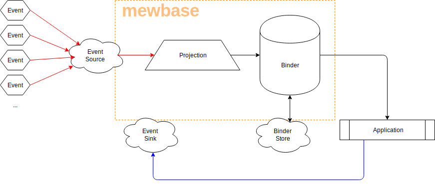

# Introduction

## Introduction
Organisations produce a lot of events, e.g. customer actions on a UI or stock movement in a supply chain. 
Many realise it's great to store *all* the events they produce, as doing so give them more data to make good decisions in the future.

We don't want event capture to impact the performance of applications, so we must have a fast, high volume mechanism that can store raw events for a long time.

Individual _applications_  our organisation implement rarely wish to process raw event data, they want to work with aggregates (or projections) at a higher level of abstraction.

## What mewbase gives
mewbase is a framework that helps you turn raw event data into aggregates.

Here is how events flow through a typical system that uses mewbase:

### Event Source

This is where raw event data comes from. It should be able to accept a large number of events, without slowing down the user or system that produces them.

Mewbase does not manage or implement the Event Source itself.

By default, mewbase is able to use any of the following as an Event Source:
* A file which contains a sequence of events
* A topic of [Apache Kafka](https://kafka.apache.org/) messages
* A subject of [NATS streaming](https://nats.io/about/) messages

In all these cases the mewbase implementation requires that incoming events are [BSON encoded](http://bsonspec.org/).

The abstraction mewbase provides makes it possible to integrate with another type of Event Source, which may not use BSON encoding.

### Projection

### Binder

### Binder store

### Application

### Event Sink

## Why mewbase is useful

## Writing your first system using mewbase

Glossary
---

| Word | Meaning |
| ---- | ------- |
| Event  | A change to the state of an application  |
| Projection   | An aggregate built by applying a function over raw events  |
| Binder   | A store of BSON documents, each accessible by an ID.  |
| Projection   | A processor of raw events. It can <ol><li>Filter events</li></ol> |
