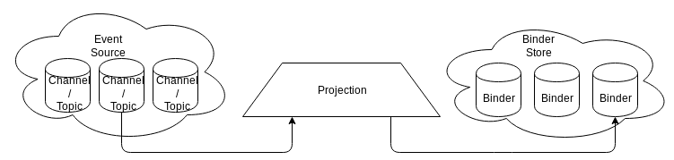
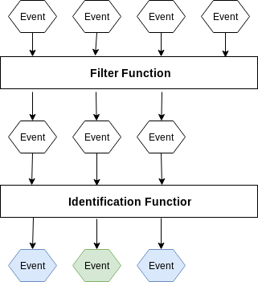
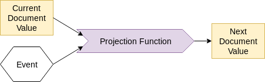

# Components of a Mewbase system

Here is how events flow through a typical system that uses Mewbase:


## Event Source

This is where raw event data comes from. It should be able to accept a large number of events, without slowing down the user or system that produces them. A single system may have many different Event Sources.

Mewbase does not manage or implement the Event Source itself.

By default, mewbase is able to use any of the following as an Event Source:
* A file which contains a sequence of events
* A topic of [Apache Kafka](https://kafka.apache.org/) messages
* A subject of [NATS streaming](https://nats.io/about/) messages

In all these cases the mewbase implementation requires that incoming events are [BSON encoded](http://bsonspec.org/).

Mewbase provides an abstraction that makes it possible to integrate with another type of Event Source, which may not use BSON encoding.

## Binder

This is a logical entity that stores an aggregate. Binders hold a collection of documents, each of which is a [BSON object](http://bsonspec.org) summarising an entity built from the raw event stream. Each document is indexed by a String.

 Applications read data either directly from binders using the Mewbase API, or through a [RESTful API](https://en.wikipedia.org/wiki/Representational_state_transfer) that mewbase has exposed. A single system may use many different binders.


As an example, an Event Source may provide events that record the purchase of products. Products may be returned if they are faulty in some way.

```json
{ "product": "chocolate", "quantity": "3", "action": "BUY" }
{ "product": "banana",    "quantity": "1", "action": "BUY" }
{ "product": "chocolate", "quantity": "2", "action": "RETURN" }
...
```

3 chocolates have been bought, but 2 returned. 1 banana has also been bought.

A binder may be built that represents the net total purchases of each product (discounting returns).

```json
[
  { "product": "chocolate", "total_purchased": 1 },
  { "product": "banana",    "total_purchased": 1 }
]
```
This binder has 2 documents, and could be indexed by `product`. An application could be written to ask the binder for the total number of chocolate purchased each day, and order more stock accordingly.

## Binder Store

This is where binders are persisted. A binder store may be responsible for the persistence of many binders. A single system may persist different binders into different binder stores.

Mewbase does not manage or implement the Binder Store itself.

By default, mewbase is able to use any of the following as a Binder Store:

* A directory on the filesystem. Each binder will be a separate sub directory, each document within a binder a separate file.
* A [PostgreSQL](https://www.postgresql.org/) schema. One table is used to store binder metadata, another table stores documents.

Mewbase provides an abstraction that makes it possible to use other persistence methods as a Binder Store.

## Projection

This is how you tell mewbase how to build and maintain a binder from a stream of raw events. Mewbase will use the projections you have defined to set the value of documents in a binder, in reaction to events received from the Event Source.

Each projection is tied to a specific Event Source and a Binder Store, but you may define multiple  projections in the same system.

### To define a projection

You tell mewbase:



* The channel or topic within the Event Source that the projection should subscribe to (e.g. Kafka topic name, if your Event Source is [Apache Kafka](https://kafka.apache.org/))
* The name of the binder the projection will maintain within the Binder Store

You must also provide functions that filter and classify events that arrive:



* The Filter Function describes which incoming raw events should be ignored by this projection
* And the Identifcation Function assigns each incoming event to a document in the binder. It transforms an event into an index String, identifying which document the event is related to.

You must also provide a Projection Function. This is a [pure function](https://en.wikipedia.org/wiki/Pure_function) that determines the next value of a document in the binder.



* After mewbase has filtered and classified an event into a document, the current value of the document is retrieved from the binder
* The event and document are then fed through the Projection Function you define
* Your Projection Function returns the next value the document should have

### Running a projection

Once the projection is defined, Mewbase is completely responsible for:

* Subscribing to the appropriate event stream from your Event Source
* Using your Filter / Identification functions to select interesting events and classify them to a document in the Binder
* Feeding any interesting events and the related document through your Projection Function
* Ensuring the document in the Binder is updated with the result of your Projection Function


## Application

Your application runs at a high level of abstraction, and mostly does not care about how data has been received, transformed and stored by Mewbase.

Applications in a Mewbase system will typically consume data from Binders: the indexed document collections built using projections.

Data can be retrieved from a Binder using the Mewbase API, or or through a [RESTful API](https://en.wikipedia.org/wiki/Representational_state_transfer) that Mewbase is able to expose.

Mewbase provides an Event Sink abstraction allowing applications to produce events.

# Summary

Accepting fine grain events as input to a system provides flexibility and business value. Mewbase provides a toolkit that allows you to accept this kind of input, but build applications from their aggregations. This makes the applications easier to reason about and maintain.

Mewbase:
* has abstractions for sending and receiving events
* provides an engine for processing them into aggregations.
* has abstractions for persistance and exposure of these aggregations

Next, let's look at a simple [Event Sourcing example](https://github.com/Tesco/mewbase/blob/master/docs/commandrest.md) which is exposed over a RESTful interface.
